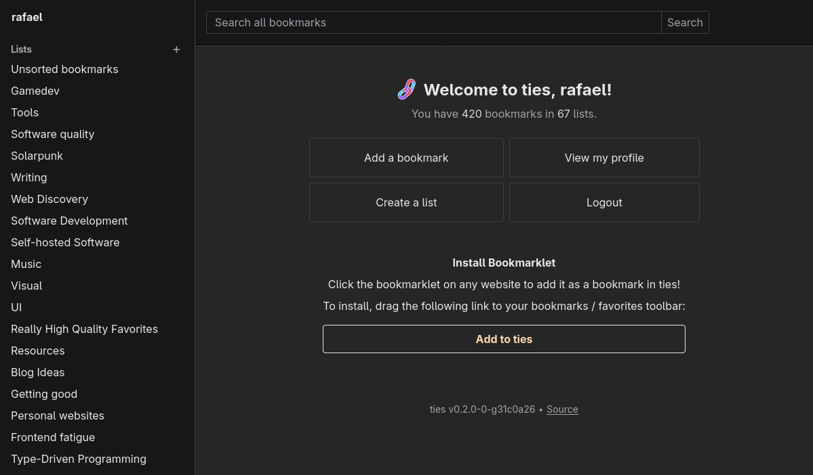
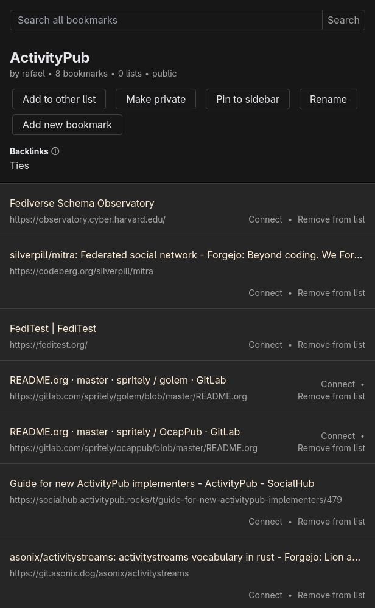
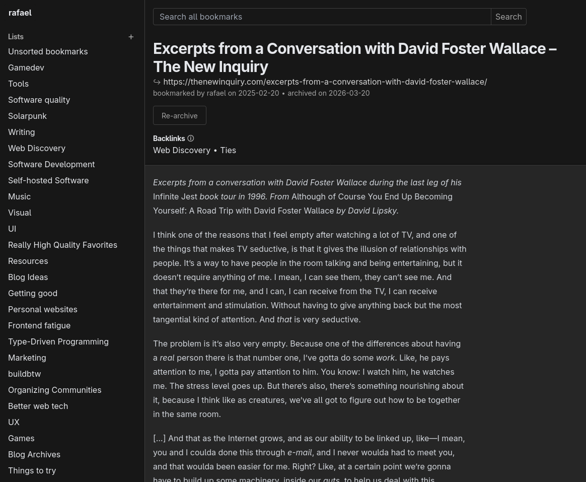

<p align="center">
    
</p>

# ties

(previously named "linkblocks")

**🔗 A federated network to bookmark, organize, share and discover good web pages.**

It's getting harder and harder to find good web pages. When you do find good ones, it's worth hanging onto them. ties is your own small corner of the web, where you can keep your favorite pages, and share them with your friends to help them find good web pages too.

🔭 ties is in an exploratory phase where we're trying out different ways to make it work well. You can try it out, but big and small things might change with every update.

[Try our demo here.](https://demo.ties.pub)

<p align="center">
    <a href="doc/img/screenshot_index.png">
        
    </a>
    <br>
    <a href="doc/img/screenshot_list.png">
        
    </a>
    <a href="doc/img/screenshot_bookmark.png">
        
    </a>
</p>

## 🌟 Vision

- With ties, you can organize, connect, browse and search your favorite web pages.
- Share carefully curated or wildly chaotic collections of the stuff you really really like with other ties users and the whole world wide web.
- Follow users with a similar taste and get a feed of fresh good web pages every day. Browse others' collections to discover new web pages from topics you like.
- Annotate, highlight and discuss web pages together with your friends.
- Mark users as trusted whose standards for web pages match yours - and then search through all trusted bookmarks to find good pages on a specific topic. Add trusted users of your trusted users to your search range to cast a wider net.

[See this blog post for more on the vision behind ties](https://www.rafa.ee/articles/introducing-linkblocks-federated-bookmark-manager/), and [our docs on core values and goals](doc/values-goals.md).

## 📖 Related Reading

- [Where have all the Websites gone?](https://www.fromjason.xyz/p/notebook/where-have-all-the-websites-gone/) talks about the importance of website curation. ties is for publicly curating websites.
- [The Small Website Discoverability Crisis](https://www.marginalia.nu/log/19-website-discoverability-crisis/) similar to the previous link, it encourages everyone to share reading lists. By the author of the amazing [marginalia search engine](https://search.marginalia.nu/).

## 🤝 Contributing

We are looking for contributors!
See [the contributing guide](CONTRIBUTING.md) to get started.


## 🚀 Installation and Configuration

⚠️ ties is in an alpha stage. Consider all data in the system to be publicly available, even bookmarks in private lists. Only single-user instances are supported.

You can run the container at `ghcr.io/raffomania/ties`.
It's recommended to use the tag of the latest stable release, e.g. `0.1.0`.
If you're feeling adventurous, there's a `latest` tag which tracks the latest commit on the `main` branch.

### With docker-compose

See [doc/docker-compose.yml](doc/docker-compose.yml) for an example configuration. Make sure to fill out the blank environment variables such as `BASE_URL` and the admin credentials, then start the server using `docker-compose up`. By default, the server will be exposed on port `3000`.

### Building from Source

Install the rust toolchain, version `1.88.0` or later. Then build the ties binary using:

```sh
cargo build --release
```

If `git` is installed, a version description will automatically be included by reading the current repository state.
You can set the environment variable `TIES_VERSION_DESCRIPTION` when building to override this with your own version description.
If the envionment variable is not set and `git` is not available, the description will be set to the current crate version in `Cargo.toml`.

### Running the Server Binary

ties is deployed using a single binary.
If you've built the binary or downloaded it from [GitHub releases](https://github.com/raffomania/ties/releases), you can run the server using `ties start`.
The only dependency is a PostgreSQL instance.

### Configuring the Server

ties is configured through environment variables or command line options.
Run `ties start --help` to for comprehensive documentation on the available options.
Let's go over a few of the central knobs you might want to configure:

- `DATABASE_URL`: [PostgreSQL Connection URI](https://www.postgresql.org/docs/current/libpq-connect.html#LIBPQ-CONNSTRING-URIS) for connecting to the database.
- `BASE_URL`: Public URL the server is reachable at. Cannot be changed once the first user has been created.
- `LISTEN`: IP address and port to listen on.
- `ADMIN_USERNAME`, `ADMIN_PASSWORD` (Optional): Create an admin user with these credentials if it doesn't exist yet.
- `OIDC_CLIENT_ID`, `OIDC_CLIENT_SECRET`, `OIDC_ISSUER_URL`, `OIDC_ISSUER_NAME` (Optional): Configuration for single-sign-on using an OIDC provider.
- `TLS_CERT`, `TLS_KEY` (Optional): Paths to TLS keypair, if you'd like to serve ties via TLS directly. If you don't set this, it's recommended to use a reverse proxy in front of ties.

### Upgrading & Stability

By default, upgrades do not require manual intervention. The database is migrated automatically when the server starts.

If an upgrade does require manual intervention, it is marked with a new minor version ([as long as we are pre-1.0](https://semver.org/)), and will be called out prominently in the [changelog](CHANGELOG.md).

## 🛠️ Development Docs

Our [Developer Docs](./doc/index.md) should cover everything you need to know. If anything is missing, feel free to [open an issue](https://github.com/raffomania/ties/issues/new) or ask a question in the [discussions](https://github.com/raffomania/ties/discussions).

See [Development Setup](./doc/development-setup.md) to get started with a local development environment.

## ⚙️ Technical Details

This web app is implemented using technologies hand-picked for a smooth development and deployment workflow. Here are some of the features of the stack:

- Type-safe and fast, implemented in [Rust](https://www.rust-lang.org/) using the [axum framework](https://github.com/tokio-rs/axum)
- Snappy interactivity using [htmx](https://htmx.org/) with almost zero client-side code
- [Tailwind styles without NodeJS](https://github.com/pintariching/railwind), integrated into the cargo build process using [build scripts](https://doc.rust-lang.org/cargo/reference/build-scripts.html)
- Compile-time verified HTML templates using [htmf](https://github.com/raffomania/htmf)
- Compile-time verified database queries using [SQLx](https://github.com/launchbadge/sqlx)
- Concurrent, isolated integration tests with per-test in-memory postgres databases
- Single-binary deployment; all assets baked in
- Integrated TLS; can run without a reverse proxy
- PostgreSQL as the only service dependency
- Built-in CLI for production maintenance
- Auto-reload in development [without dropped connections](https://github.com/mitsuhiko/listenfd)

## 📋 Software Bill of Materials

An up-to-date Software Bill of Materials can be found in the [ties.cdx.json](ties.cdx.json) file.

## 💙 Acknowledgements

 

ties is made possible with a [donation](https://nlnet.nl/commonsfund/acknowledgement.pdf) from NGI Zero Commons Fund.
NGI Zero Commons Fund is part of the [European Commission](https://ec.europa.eu/)'s [Next Generation Internet](https://ngi.eu/) initiative, established under the aegis of the [DG Communications Networks, Content and Technology](https://ec.europa.eu/info/departments/communications-networks-content-and-technology_en).
Additional funding is made available by the Swiss State Secretariat for Education, Research and Innovation (SERI).
